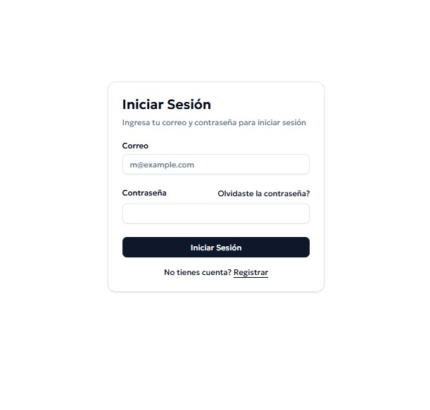

# LoginApp

## <p align="center">Preview <p>
<p align="center">
  
</p>

## Construido usando Vite 🛠️ 

_Herramientas utilizadas:_

* [Tailwind CSS](https://tailwindcss.com/docs/installation/using-vite) - Framework CSS
* [Shadcn UI](https://ui.shadcn.com/) - Incorporación de componentes
* [ReactRouter](https://reactrouter.com/start/data/installation) - Usado para manejo de rutas
* [React-Spinners](https://www.davidhu.io/react-spinners/) - Spinners implementados al cambiar de componente
* [Sonner](https://sonner.emilkowal.ski/getting-started) - Toast component minimalista
* [React-Hook-Form](https://react-hook-form.com/get-started) - Manejo de formulario, validación de datos
* [Zustand](https://zustand.docs.pmnd.rs/getting-started/introduction) - Zustand para manejo del estado global
* [v0 by Vercel](https://v0.app/) -  Herramienta de IA generativa UI
## Clonar repositorio 🚀
```bash
git clone https://github.com/JeffryValle/login-app.git
```

## Instalar dependencias 🚀
```javascript
npm install
```

## Servir proyecto 📄
```javascript
npm run dev
```


